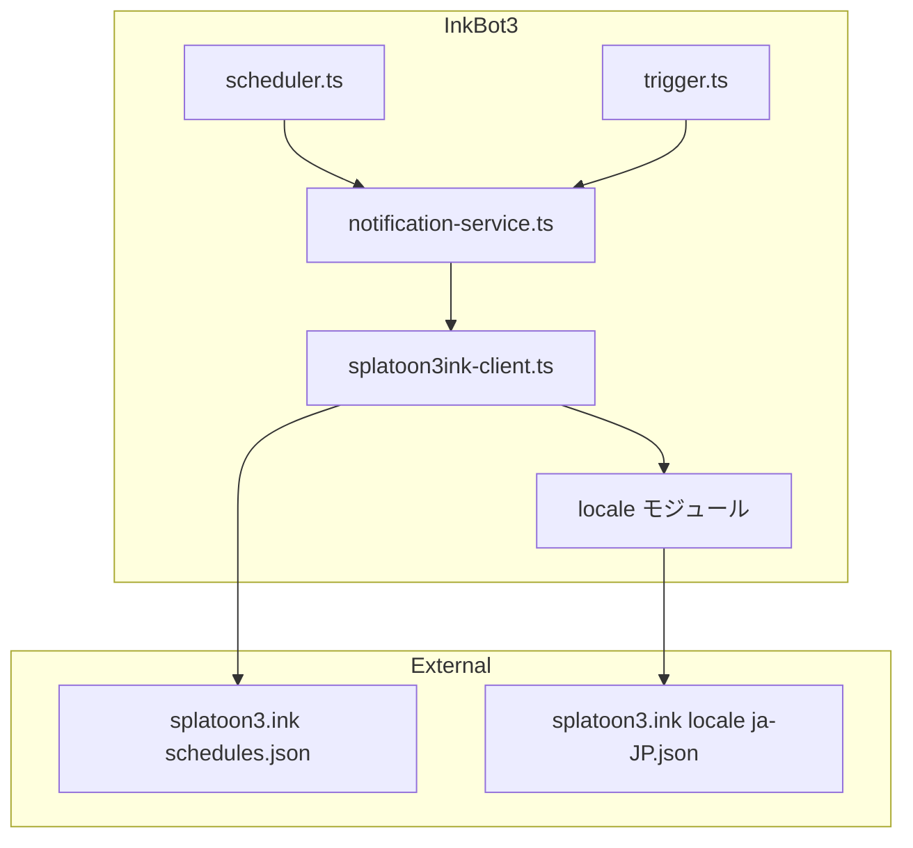
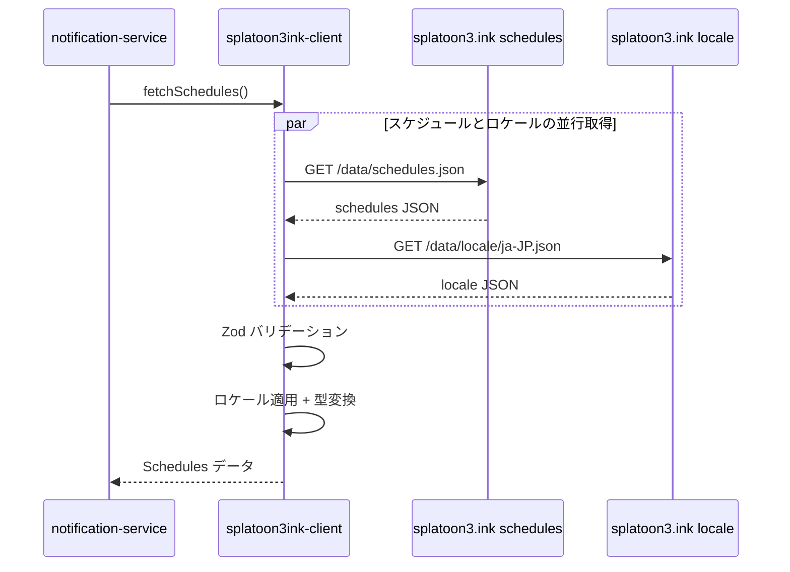

# 技術設計書

## 概要

**目的**: スケジュールデータの取得元を Spla3 API (`spla3.yuu26.com`) から splatoon3.ink API に移行し、安定したコミュニティ標準のデータソースを利用する。

**ユーザー**: Discord サーバーの管理者・ユーザーが、日本語でのスケジュール通知を引き続き受け取る。

**影響**: API クライアント (`spla3-client.ts`) を `splatoon3ink-client.ts` に置き換え、Zod スキーマ・型定義・変換ロジックを splatoon3.ink のレスポンス構造に合わせて再設計する。通知サービスの import パスと型名を更新する。

### ゴール
- splatoon3.ink API からバトル・サーモンランスケジュールを取得する
- locale/ja-JP.json を利用してすべての名称を日本語で表示する
- 既存の通知フォーマットとユーザー体験を維持する

### 非ゴール
- API レスポンスのキャッシュ機構の導入
- 複数ロケール対応（日本語のみ）
- splatoon3.ink 以外のフォールバック API の導入

## アーキテクチャ

### 既存アーキテクチャ分析

現行の呼び出しフロー:

```
scheduler.ts / trigger.ts
  → notification-service.ts (sendScheduleNotification)
    → spla3-client.ts (fetchBattleSchedules, fetchCoopSchedules)
      → Spla3 API (spla3.yuu26.com)
```

変更対象は `spla3-client.ts` のみ。`notification-service.ts` はエクスポートされる型と関数のシグネチャが変わるため import と型名を更新する。`scheduler.ts`, `trigger.ts`, `index.ts` は `notification-service.ts` 経由で間接的に API を利用しており、変更不要。

### アーキテクチャパターン & 境界マップ



- **選択パターン**: 直接置き換え（旧ファイルを新ファイルに置換）
- **ドメイン境界**: API クライアント層のみ変更。通知フォーマット層は型名の更新のみ
- **維持するパターン**: ファクトリ関数によるエクスポート、Zod バリデーション、readonly 型

### テクノロジースタック

| レイヤー | 選択 / バージョン | フィーチャーでの役割 | 備考 |
|---------|-----------------|-------------------|------|
| ランタイム | Node.js 22 | API フェッチ | 変更なし |
| バリデーション | Zod v4 | API レスポンスバリデーション | スキーマ再定義 |
| HTTP | Node.js fetch API | splatoon3.ink へのリクエスト | 変更なし |
| 型定義 | TypeScript ES2022 | 内部データ型 | 型名を再設計 |

## システムフロー

### スケジュール取得フロー



**設計判断**: schedules.json と locale/ja-JP.json を `Promise.all` で並行取得する。cron 実行が毎時1回のため、毎回フェッチしてもポリシーに適合する。

## 要件トレーサビリティ

| 要件 | サマリー | コンポーネント | インターフェース | フロー |
|------|---------|-------------|----------------|-------|
| 1.1 | schedules.json からデータ取得 | splatoon3ink-client | fetchSchedules | スケジュール取得フロー |
| 1.2 | バトルスケジュール抽出 | splatoon3ink-client | fetchSchedules | — |
| 1.3 | サーモンランスケジュール抽出 | splatoon3ink-client | fetchSchedules | — |
| 1.4 | バンカラ CHALLENGE/OPEN 分離 | splatoon3ink-client | fetchSchedules | — |
| 1.5 | Zod バリデーション | splatoon3ink-client | schedulesResponseSchema | — |
| 1.6 | User-Agent ヘッダー | splatoon3ink-client | fetchSchedules | — |
| 1.7 | エラーハンドリング | splatoon3ink-client | fetchSchedules | — |
| 2.1 | ロケールデータ取得 | splatoon3ink-client | fetchLocale | スケジュール取得フロー |
| 2.2 | ID ベースルックアップ | splatoon3ink-client | localize | — |
| 2.3 | 全カテゴリの日本語変換 | splatoon3ink-client | localize | — |
| 2.4 | 英語名フォールバック | splatoon3ink-client | localize | — |
| 3.1 | 型名の再設計 | splatoon3ink-client | 全型定義 | — |
| 3.2 | notification-service 更新 | notification-service | import 更新 | — |
| 3.3 | テスト更新 | notification-service.test | 型名更新 | — |
| 3.4 | 呼び出し元更新 | notification-service | import 更新 | — |
| 4.1 | 旧 URL 削除 | splatoon3ink-client | — | — |
| 4.2 | 旧スキーマ置き換え | splatoon3ink-client | — | — |
| 4.3 | snake_case 変換削除 | splatoon3ink-client | — | — |
| 4.4 | ファイル名変更 | splatoon3ink-client | — | — |
| 5.1 | 取得頻度制限 | scheduler（既存） | — | — |
| 5.2 | User-Agent 設定 | splatoon3ink-client | USER_AGENT 定数 | — |

## コンポーネント & インターフェース

| コンポーネント | ドメイン/レイヤー | 責務 | 要件カバレッジ | 主要依存関係 | コントラクト |
|-------------|---------------|------|-------------|------------|------------|
| splatoon3ink-client | API クライアント層 | スケジュール取得・ローカライズ・型変換 | 1.1-1.7, 2.1-2.4, 4.1-4.4, 5.1-5.2 | splatoon3.ink API (P0) | Service |
| notification-service | 通知フォーマット層 | Embed 構築・送信 | 3.1-3.4 | splatoon3ink-client (P0) | Service |

### API クライアント層

#### splatoon3ink-client

| フィールド | 詳細 |
|----------|------|
| 責務 | splatoon3.ink API からスケジュール・ロケールデータを取得し、日本語名に変換した内部型を返す |
| 要件 | 1.1-1.7, 2.1-2.4, 4.1-4.4, 5.1-5.2 |

**責務 & 制約**
- splatoon3.ink API との通信を一元管理する
- Zod スキーマでレスポンスをバリデーションする
- ロケールデータの取得・適用を API クライアント内で完結させる
- エクスポートする型は splatoon3.ink のデータ構造に即した命名とする

**依存関係**
- External: splatoon3.ink schedules.json — スケジュールデータ (P0)
- External: splatoon3.ink locale/ja-JP.json — 日本語ローカライズデータ (P0)
- External: Zod v4 — バリデーション (P0)

**コントラクト**: Service [x]

##### サービスインターフェース

```typescript
// --- エクスポートされる型定義 ---

interface VsStage {
  readonly id: string;
  readonly vsStageId: number;
  readonly name: string;        // 日本語名（ローカライズ済）
  readonly image: string;       // 画像 URL
}

interface VsRule {
  readonly id: string;
  readonly key: string;         // "TURF_WAR", "AREA" 等
  readonly name: string;        // 日本語名（ローカライズ済）
}

interface VsScheduleEntry {
  readonly startTime: string;
  readonly endTime: string;
  readonly rule: VsRule;
  readonly stages: ReadonlyArray<VsStage>;
}

interface LeagueMatchEvent {
  readonly id: string;
  readonly leagueMatchEventId: string;
  readonly name: string;        // 日本語名
  readonly desc: string;        // 日本語説明
}

interface EventScheduleEntry {
  readonly event: LeagueMatchEvent;
  readonly rule: VsRule;
  readonly stages: ReadonlyArray<VsStage>;
  readonly timePeriods: ReadonlyArray<{
    readonly startTime: string;
    readonly endTime: string;
  }>;
}

interface FestScheduleEntry {
  readonly startTime: string;
  readonly endTime: string;
  readonly rule: VsRule | null;
  readonly stages: ReadonlyArray<VsStage> | null;
  readonly isTricolor: boolean;
  readonly tricolorStages: ReadonlyArray<VsStage> | null;
}

interface CoopWeapon {
  readonly name: string;        // 日本語名
  readonly image: string;       // 画像 URL
}

interface CoopStage {
  readonly id: string;
  readonly name: string;        // 日本語名
  readonly image: string;       // 画像 URL
}

interface CoopBoss {
  readonly id: string;
  readonly name: string;        // 日本語名
}

interface CoopScheduleEntry {
  readonly startTime: string;
  readonly endTime: string;
  readonly boss: CoopBoss;
  readonly stage: CoopStage;
  readonly weapons: ReadonlyArray<CoopWeapon>;
  readonly isBigRun: boolean;
}

interface Schedules {
  readonly regular: ReadonlyArray<VsScheduleEntry>;
  readonly bankaraChallenge: ReadonlyArray<VsScheduleEntry>;
  readonly bankaraOpen: ReadonlyArray<VsScheduleEntry>;
  readonly x: ReadonlyArray<VsScheduleEntry>;
  readonly event: ReadonlyArray<EventScheduleEntry>;
  readonly fest: ReadonlyArray<FestScheduleEntry>;
  readonly coop: ReadonlyArray<CoopScheduleEntry>;
}

// --- エクスポートされる関数 ---

function fetchSchedules(): Promise<Schedules>;
```

- 前提条件: ネットワーク接続が利用可能
- 事後条件: 返却される全名称は日本語（ロケールデータ存在時）。ロケールに存在しない ID は英語名がフォールバック
- 不変条件: `bankaraChallenge` と `bankaraOpen` は同一ノードの `bankaraMatchSettings` から分離される

**実装ノート**
- schedules.json と locale/ja-JP.json を `Promise.all` で並行取得する
- バリデーション失敗時はエラーログ出力後に例外スロー
- `User-Agent: inkbot3 (Discord Bot)` ヘッダーを全リクエストに設定
- weapons のローカライズキーは `__splatoon3ink_id`（hex 文字列）、他は `id`（base64 文字列）
- `coopGroupingSchedule.bigRunSchedules.nodes[]` のエントリは `isBigRun: true` として `coop` 配列にマージする

### 通知フォーマット層

#### notification-service

| フィールド | 詳細 |
|----------|------|
| 責務 | splatoon3ink-client から取得したスケジュールデータを Discord Embed にフォーマットして送信する |
| 要件 | 3.1-3.4 |

**実装ノート**
- import パスを `./spla3-client.js` → `./splatoon3ink-client.js` に変更
- 型名を新しい命名に合わせて更新（`BattleSchedules` → `Schedules`、`ScheduleEntry` → `VsScheduleEntry`、`Stage` → `VsStage`、`Rule` → `VsRule` 等）
- `fetchBattleSchedules()` + `fetchCoopSchedules()` の2回呼び出しを `fetchSchedules()` の1回呼び出しに統合
- `EventScheduleEntry` の構造変更に対応: 旧 `startTime`/`endTime` → 新 `timePeriods[]`
- `groupEventEntries` のグルーピングロジックは不要になる（API が既にイベント単位でグルーピング済）
- `FestScheduleEntry` から `isFest` フィールドを削除（splatoon3.ink では不要）

## データモデル

### ドメインモデル

splatoon3.ink API レスポンスから内部型への変換マッピング:

| splatoon3.ink パス | 内部型 | 変換内容 |
|-------------------|-------|---------|
| `data.regularSchedules.nodes[]` | `VsScheduleEntry` | `regularMatchSetting` からルール・ステージ抽出 |
| `data.bankaraSchedules.nodes[].bankaraMatchSettings[0]` | `VsScheduleEntry` (challenge) | `bankaraMode: "CHALLENGE"` のエントリ |
| `data.bankaraSchedules.nodes[].bankaraMatchSettings[1]` | `VsScheduleEntry` (open) | `bankaraMode: "OPEN"` のエントリ |
| `data.xSchedules.nodes[]` | `VsScheduleEntry` | `xMatchSetting` からルール・ステージ抽出 |
| `data.eventSchedules.nodes[]` | `EventScheduleEntry` | `leagueMatchSetting` + `timePeriods` |
| `data.festSchedules.nodes[]` | `FestScheduleEntry` | `festMatchSettings` から抽出（null 時はスキップ） |
| `data.coopGroupingSchedule.regularSchedules.nodes[]` | `CoopScheduleEntry` | `setting` からボス・ステージ・ブキ抽出、`isBigRun: false` |
| `data.coopGroupingSchedule.bigRunSchedules.nodes[]` | `CoopScheduleEntry` | 同上、`isBigRun: true` |

### データコントラクト

**ローカライズルックアップ**

| カテゴリ | ルックアップキー | ソース | ロケールフィールド |
|---------|---------------|--------|-----------------|
| stages | `id` (base64) | `VsStage.id` | `{ name }` |
| rules | `id` (base64) | `VsRule.id` | `{ name }` |
| weapons | `__splatoon3ink_id` (hex) | weapon オブジェクト | `{ name }` |
| bosses | `id` (base64) | `boss.id` | `{ name }` |
| events | `id` (base64) | `leagueMatchEvent.id` | `{ name, desc, regulation }` |

## エラーハンドリング

### エラー戦略

現行と同一のパターンを維持する。

### エラーカテゴリとレスポンス

| エラー種別 | 条件 | 対応 |
|----------|------|------|
| HTTP エラー | schedules.json または locale/ja-JP.json のフェッチ失敗 | エラーログ出力 + 例外スロー |
| バリデーションエラー | Zod スキーマのパース失敗 | エラー詳細をログ出力 + 例外スロー |
| ローカライズ欠落 | ロケールファイルに ID が存在しない | 英語名をフォールバック（警告なし） |

notification-service 側の既存エラーハンドリング（try-catch + エラー Embed 送信）は変更不要。

## テスト戦略

### ユニットテスト
- splatoon3ink-client の Zod スキーマバリデーション: 正常系・異常系のレスポンスデータ
- ローカライズルックアップ: ID 一致・不一致・フォールバック
- バンカラ CHALLENGE/OPEN 分離ロジック
- bigRun エントリのマージロジック

### 統合テスト
- notification-service.test.ts の既存テストを新型名で更新し、全テストがパスすることを確認
- `buildScheduleEmbeds` が新しいデータ型で正しい Embed を生成することを確認

### 手動テスト
- `npm run trigger` で実際の splatoon3.ink API からデータ取得し、Discord に通知が送信されることを確認
