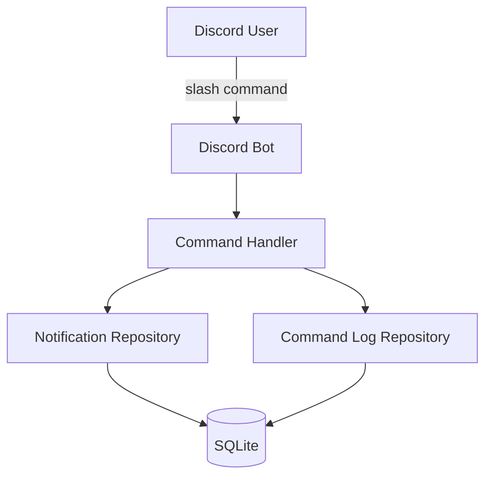
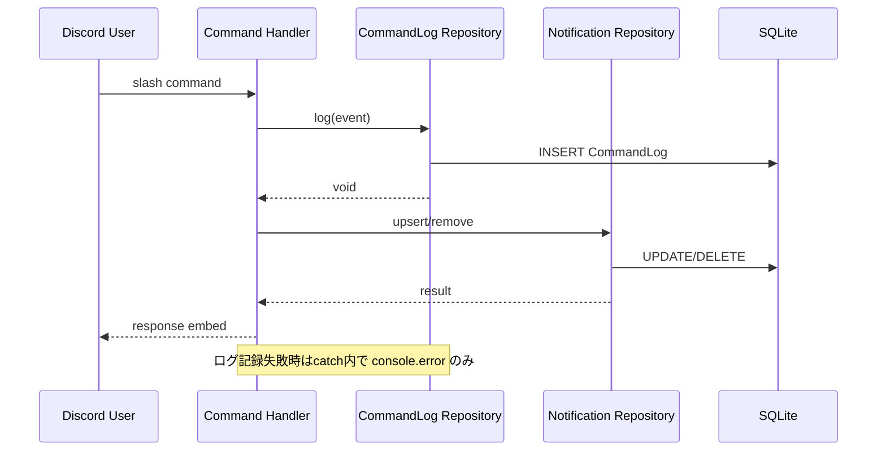

# Design Document: event-logging

## Overview

**Purpose**: コマンド実行イベントをデータベースに蓄積し、ボットの利用状況を後から分析可能にする。

**Users**: 運用者・分析者がサーバーごと・ユーザーごとの利用傾向を把握するために利用する。

**Impact**: 既存のコマンドハンドラにログ記録処理を追加し、新規 Prisma モデルとリポジトリを導入する。

### Goals
- コマンド実行イベント（誰が・どこで・何を）をDBに永続化する
- ID と名前の両方を記録し、後からの分析を容易にする
- コマンド追加時にスキーマ変更が不要な汎用テーブル設計

### Non-Goals
- ログの可視化ダッシュボードやレポート機能
- 通知配信（scheduler）イベントのログ記録
- ログデータの自動削除・ローテーション

## Architecture

### Existing Architecture Analysis

既存アーキテクチャのポイント:
- ファクトリ関数パターンによるリポジトリ（`createNotificationRepository`）
- `index.ts` でのコンポーネント配線（config → database → repository → bot → handler → scheduler）
- `setupCommandHandler` が client と repository を受け取り、インタラクションリスナーを登録
- Prisma 7 + better-sqlite3 アダプタによる SQLite 永続化

### Architecture Pattern & Boundary Map



**Architecture Integration**:
- Selected pattern: 既存のファクトリ関数パターンを拡張
- Domain boundaries: コマンドログは独立したリポジトリとして分離し、既存の通知機能に影響しない
- Existing patterns preserved: ファクトリ関数、Prisma DI、index.ts での配線
- New components rationale: `CommandLog` モデルと `createCommandLogRepository` を新規追加。既存コンポーネントの責務を変えずにログ機能を注入する

### Technology Stack

| Layer | Choice / Version | Role in Feature | Notes |
|-------|------------------|-----------------|-------|
| Data / Storage | Prisma 7 + SQLite | CommandLog テーブルの永続化 | 既存スタックと同一 |
| Backend / Services | discord.js 14 | Interaction からのデータ取得 | 追加の intents 不要 |

## System Flows



ログ記録はコマンド処理の先頭で fire-and-forget 的に実行し、失敗してもコマンド本体の処理を継続する。

## Requirements Traceability

| Requirement | Summary | Components | Interfaces | Flows |
|-------------|---------|------------|------------|-------|
| 1.1 | コマンドイベントのDB保存 | CommandLog, CommandLogRepository | `log()` | Command Flow |
| 1.2 | コマンド名の記録 | CommandLog | `commandName` field | — |
| 1.3 | 実行時刻の記録 | CommandLog | `createdAt` field | — |
| 1.4 | 汎用テーブル設計 | CommandLog | `commandName` as string | — |
| 2.1 | ギルドID・名の記録 | CommandLog | `guildId`, `guildName` fields | — |
| 2.2 | チャンネルID・名の記録 | CommandLog | `channelId`, `channelName` fields | — |
| 2.3 | ギルド外は対象外 | Command Handler | guildId null チェック（既存） | — |
| 3.1 | ユーザーID・名の記録 | CommandLog | `userId`, `userName` fields | — |
| 4.1 | パラメータの文字列記録 | CommandLog | `options` field | — |
| 5.1 | ログ失敗時の継続性 | Command Handler | try-catch | Command Flow |
| 5.2 | ログ失敗時のエラー出力 | Command Handler | console.error | — |

## Components and Interfaces

| Component | Domain/Layer | Intent | Req Coverage | Key Dependencies | Contracts |
|-----------|--------------|--------|--------------|------------------|-----------|
| CommandLog | Data Model | コマンド実行イベントの永続化モデル | 1.1-1.4, 2.1-2.3, 3.1, 4.1 | Prisma (P0) | — |
| CommandLogRepository | Data Access | コマンドログのCRUD | 1.1 | PrismaClient (P0) | Service |
| Command Handler (変更) | Application | ログ記録の呼び出し | 5.1, 5.2 | CommandLogRepository (P1) | — |

### Data Access Layer

#### CommandLogRepository

| Field | Detail |
|-------|--------|
| Intent | コマンド実行イベントをデータベースに保存する |
| Requirements | 1.1 |

**Responsibilities & Constraints**
- コマンド実行イベントの INSERT のみを担当
- 既存の NotificationRepository とは独立

**Dependencies**
- Inbound: Command Handler — ログ記録の呼び出し (P0)
- External: PrismaClient — DB アクセス (P0)

**Contracts**: Service [x]

##### Service Interface
```typescript
interface CommandLogInput {
  commandName: string;
  guildId: string;
  guildName: string;
  channelId: string;
  channelName: string;
  userId: string;
  userName: string;
  options: string | null;
}

interface CommandLogRepository {
  log(input: CommandLogInput): Promise<void>;
}
```
- Preconditions: `commandName`, `guildId`, `guildName`, `channelId`, `channelName`, `userId`, `userName` は空でない文字列
- Postconditions: CommandLog レコードが1件 INSERT される
- Invariants: 既存データに影響しない（INSERT only）

### Application Layer

#### Command Handler（変更）

| Field | Detail |
|-------|--------|
| Intent | 既存のコマンドハンドラにログ記録を組み込む |
| Requirements | 5.1, 5.2 |

**Responsibilities & Constraints**
- `setupCommandHandler` が `CommandLogRepository` を追加で受け取る
- `handleSubscribe`、`handleUnsubscribe` の先頭でログ記録を呼び出す
- ログ記録は try-catch で囲み、失敗してもコマンド処理を継続

**Dependencies**
- Inbound: Discord.js InteractionCreate event (P0)
- Outbound: CommandLogRepository — ログ記録 (P1)
- Outbound: NotificationRepository — 通知設定の操作 (P0)

**Implementation Notes**
- Interaction からのデータ抽出ロジックをヘルパーとして切り出す必要はない。各ハンドラ内で直接取得する
- オプションの文字列化: `interaction.options.data.map(o => \`${o.name}=${o.value}\`).join(", ")` のようにシンプルに構成
- ギルド名: `interaction.guild?.name ?? null`
- チャンネル名: `interaction.channel && "name" in interaction.channel ? interaction.channel.name : null`

## Data Models

### Physical Data Model

#### CommandLog テーブル

```prisma
model CommandLog {
  id          Int      @id @default(autoincrement())
  commandName String
  guildId     String
  guildName   String
  channelId   String
  channelName String
  userId      String
  userName    String
  options     String?
  createdAt   DateTime @default(now())
}
```

| Column | Type | Nullable | Description |
|--------|------|----------|-------------|
| id | Int | No | 主キー（自動採番） |
| commandName | String | No | 実行されたコマンド名 |
| guildId | String | No | Discord ギルドID |
| guildName | String | No | Discord ギルド名 |
| channelId | String | No | Discord チャンネルID |
| channelName | String | No | Discord チャンネル名 |
| userId | String | No | 実行ユーザーID |
| userName | String | No | 実行ユーザー名 |
| options | String | Yes | コマンドオプション（例: `hour=7`） |
| createdAt | DateTime | No | イベント記録日時 |

インデックスは初期段階では不要。分析クエリのパターンが明確になった段階で追加を検討する。

## Error Handling

### Error Strategy
- ログ記録処理は try-catch で囲む
- 失敗時は `console.error` でエラー内容を出力し、コマンド本体の処理を継続する
- ユーザーへのエラー通知は行わない（ログ記録はユーザーに見えない内部処理）

## Testing Strategy

### Unit Tests
- `CommandLogRepository.log()` が正しいデータで INSERT を実行すること
- nullable フィールド（options）が null の場合に正常に動作すること

### Integration Tests
- コマンドハンドラでログ記録が呼び出されること
- ログ記録失敗時にコマンド処理が正常に継続すること
