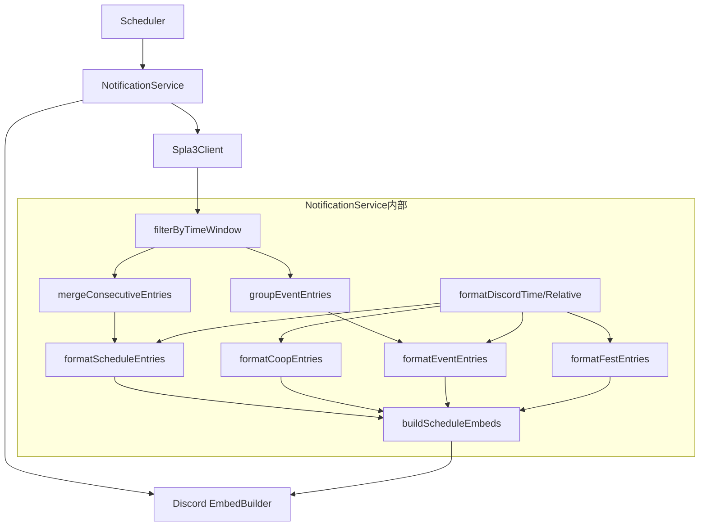

# Design Document: schedule-post-display-compression

## Overview

**Purpose**: Discordタイムスタンプ形式の採用、24時間フィルタ、連続同一バトル統合、同一イベントの時刻グルーピングにより、各Embedの情報密度を最適化する。バトル系4タイプは色分けされた個別Embedを維持する。

**Users**: Discordサーバー上でSplatoon 3のスケジュール通知を受け取るユーザー。

**Impact**: `notification-service.ts`のフォーマット関数群と`buildScheduleEmbeds()`を改修する。

### Goals
- Discordタイムスタンプ形式（日付+時刻 `:f`）でローカルタイムゾーン対応・相対時刻表示を実現
- 24時間以内のスケジュールのみに絞り込み、デイリー通知の情報密度を最適化
- 連続する同一バトルをマージして冗長表示を排除
- 同一イベントマッチを時刻列挙形式でグルーピング
- バトル系4タイプの個別Embed（色分け）を維持

### Non-Goals
- Embedのデザイン（画像、サムネイル等）の追加
- スケジュールデータの永続化やキャッシュ
- コマンド体系（/subscribe, /unsubscribe）の変更
- spla3-client.tsのAPI呼び出しロジックの変更

## Architecture

### Existing Architecture Analysis

現在の`notification-service.ts`は以下の実装済み関数を持つ:
- `formatDiscordTime()` — ISO 8601 → `<t:UNIX:t>` 変換（→ `:f` に変更）
- `formatDiscordRelative()` — ISO 8601 → `<t:UNIX:R>` 変換
- `filterByTimeWindow()` — 24h以内フィルタ
- `mergeConsecutiveEntries()` — バトル系連続エントリ統合
- `mergeConsecutiveEventEntries()` — イベント連続エントリ統合（→ グルーピング方式に変更）
- `formatBattleSection()` — バトルセクションフォーマット（→ 不要、削除）
- `formatEventEntries()` — イベントマッチフォーマット（→ グルーピング方式に変更）
- `formatFestEntries()` — フェスフォーマット（実装済み）
- `formatCoopEntries()` — サーモンランフォーマット（実装済み）
- `buildScheduleEmbeds()` — Embed構築（→ 個別Embed方式に変更）

変更対象は`notification-service.ts`のみ。API呼び出し層（`spla3-client.ts`）およびスケジューラ（`scheduler.ts`）は変更不要。

### Architecture Pattern & Boundary Map



## Key Changes from Previous Design

### 1. タイムスタンプ形式変更: `:t` → `:f`
`formatDiscordTime()`の出力を`<t:UNIX:t>`（短時刻）から`<t:UNIX:f>`（日付+時刻）に変更する。

### 2. Embed分離の復元
`buildScheduleEmbeds()`を改修し、バトル4タイプをそれぞれ個別のEmbedとして出力する。各タイプの既存色を維持する。`formatBattleSection()`は不要になるため削除し、新しい`formatScheduleEntries()`を作成する。

### 3. イベントマッチの時刻グルーピング
`mergeConsecutiveEventEntries()`を`groupEventEntries()`に置き換える。隣接条件（endTime === startTime）を撤廃し、同一`event.id`のエントリをグルーピングする。表示では時刻を列挙形式にする。

```
**イベント名**
説明文
00:00〜02:00, 04:00〜06:00 (相対時刻)
ルール: ガチエリア
ステージ: ステージA, ステージB
```

## Components and Interfaces

| Component | Intent | Changes |
|-----------|--------|---------|
| formatDiscordTime | ISO→Discordタイムスタンプ変換 | `:t` → `:f` に変更 |
| formatDiscordRelative | ISO→Discord相対時刻変換 | 変更なし |
| filterByTimeWindow | 24h以内フィルタ | 変更なし |
| mergeConsecutiveEntries | バトル連続エントリ統合 | 変更なし |
| groupEventEntries | 同一event.idのグルーピング | 新規（mergeConsecutiveEventEntriesを置換） |
| formatScheduleEntries | バトルスケジュールテキスト生成 | 新規（formatBattleSectionを置換） |
| formatEventEntries | イベントマッチテキスト生成 | グルーピング方式に変更 |
| formatFestEntries | フェステキスト生成 | 変更なし |
| formatCoopEntries | サーモンランテキスト生成 | 変更なし |
| buildScheduleEmbeds | Embed配列構築 | 個別Embed方式に変更 |

### groupEventEntries

```typescript
interface GroupedEventEntry {
  readonly event: { readonly id: string; readonly name: string; readonly desc: string };
  readonly rule: Rule;
  readonly stages: ReadonlyArray<Stage>;
  readonly timeRanges: ReadonlyArray<{ readonly startTime: string; readonly endTime: string }>;
}

function groupEventEntries(
  entries: ReadonlyArray<EventScheduleEntry>
): ReadonlyArray<GroupedEventEntry>;
```
- 同一`event.id`のエントリをグルーピング
- 隣接していなくてもグルーピング対象
- 各グループの時刻範囲を配列として保持

### formatScheduleEntries

```typescript
function formatScheduleEntries(
  entries: ReadonlyArray<ScheduleEntry>,
  options: { readonly omitRule: boolean }
): string;
```
- formatBattleSectionの後継（タイトル見出しなし）
- omitRule=trueでルール行省略（ナワバリバトル用）
- 空配列時は「スケジュールなし」を返す

### buildScheduleEmbeds（改修）

```typescript
function buildScheduleEmbeds(
  battle: BattleSchedules,
  coop: ReadonlyArray<CoopScheduleEntry>,
  now: Date
): EmbedBuilder[];
```
- バトル4タイプ: 個別Embed（各色維持）
- ナワバリバトル: Colors.Regular、ルール省略
- バンカラ チャレンジ/オープン: Colors.Bankara
- Xマッチ: Colors.XMatch
- サーモンラン: Colors.SalmonRun
- イベントマッチ: Colors.Event（条件付き）
- フェス: Colors.Fest（条件付き）
- 24hフィルタ後に0件のEmbedは省略

## Error Handling

既存のエラーハンドリングを維持する（要件9）。変更なし。

## Testing Strategy

### Unit Tests
- `formatDiscordTime`: ISO文字列 → `<t:UNIX:f>` 形式の正常変換
- `groupEventEntries`: 同一event.idのグルーピング、異なるevent.idの非グルーピング、非隣接エントリのグルーピング
- `formatScheduleEntries`: ルール省略、ルール表示、空配列
- `formatEventEntries`: グルーピング後の時刻列挙表示

### Integration Tests
- `buildScheduleEmbeds`: 通常時のEmbed数・色・内容の検証
- `buildScheduleEmbeds`: 24hフィルタ・連続統合の適用検証
