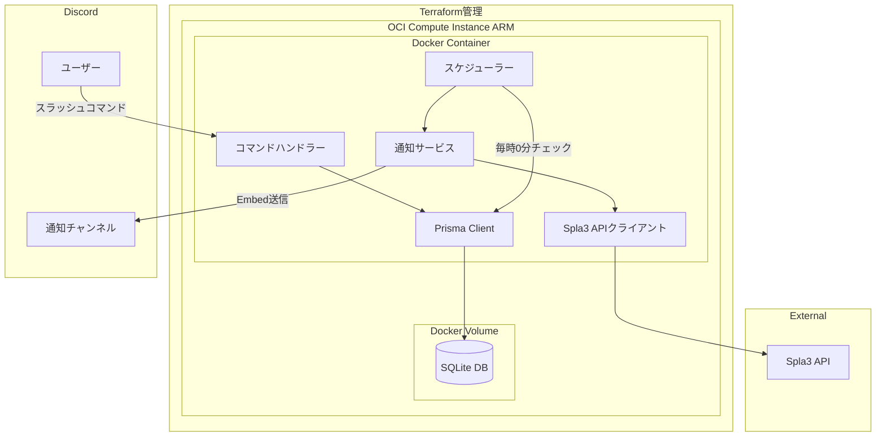
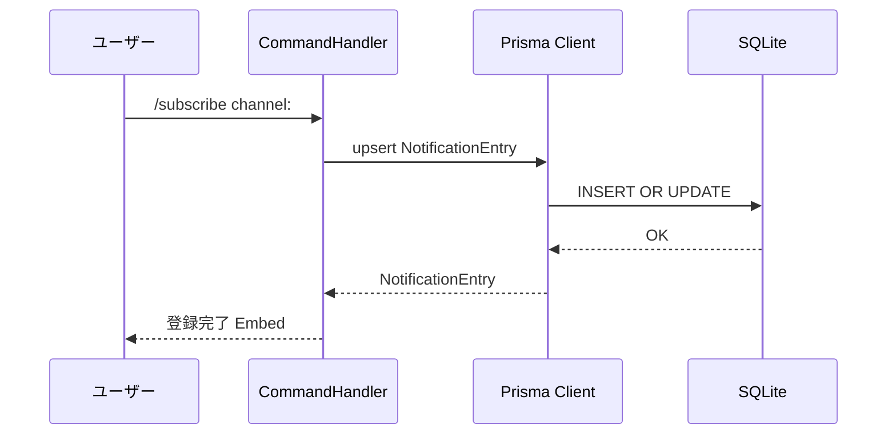
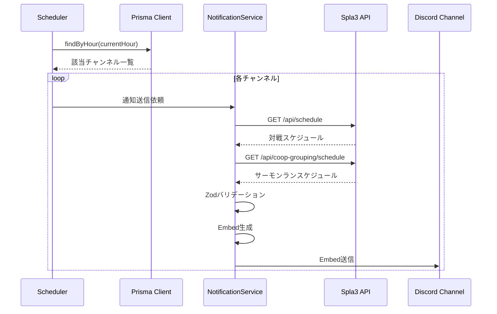
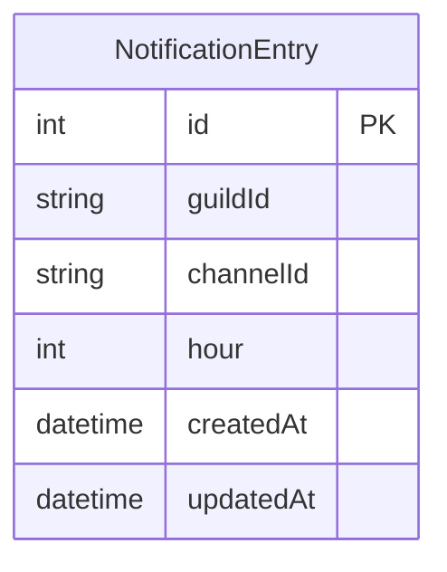

# Design Document

## Overview

**Purpose**: スプラトゥーン3の全スケジュール情報（レギュラー・バンカラ・X・イベント・サーモンラン・フェス）を、毎日指定時刻にDiscordチャンネルへ自動通知する機能を提供する。
**Users**: Discordサーバーの管理者が通知を設定し、サーバーメンバー全員がスケジュール情報を受け取る。
**Impact**: 新規プロジェクトとしてゼロから構築する。OCI上のDockerコンテナとしてデプロイする。

### Goals

- Discordスラッシュコマンドによる通知チャンネル登録・解除
- 登録時刻での全スケジュール種別の自動定期通知
- Spla3 APIからのデータ取得とZodによる型安全なバリデーション
- Prisma + SQLiteによる通知設定の永続化
- Docker化してOCI上で運用

### Non-Goals

- オンデマンドでのスケジュール照会機能
- Webダッシュボードや管理画面
- 複数言語対応（日本語のみ）
- ステージ画像の表示
- CI/CDパイプラインの構築

## Architecture

### Architecture Pattern & Boundary Map



**Architecture Integration**:

- Selected pattern: レイヤードアーキテクチャ（コマンド層→サービス層→データ/外部連携層）。小規模プロジェクトに適した構成
- Domain boundaries: コマンド処理、スケジューリング、通知生成、API通信、データ永続化を分離
- New components rationale: 各コンポーネントは単一責任原則に基づき分離
- Infrastructure: Terraformで管理されたOCI Compute Instance（ARM）上のDockerコンテナとして動作。SQLiteファイルはDockerボリュームで永続化

### Technology Stack

| Layer | Choice / Version | Role in Feature | Notes |
|-------|------------------|-----------------|-------|
| Runtime | Node.js 22 LTS | アプリケーション実行環境 | ARM64対応 |
| Language | TypeScript 5.9 | 型安全な実装 | `strict`モード |
| Bot Framework | discord.js 14.25 | Discord Bot接続・コマンド・Embed | 既存依存 |
| Validation | Zod 4.3 | APIレスポンスバリデーション | 既存依存 |
| ORM | Prisma 7 | 型安全なDB操作・マイグレーション | 新規追加 |
| Database | SQLite | 通知設定の永続化 | better-sqlite3アダプター |
| Scheduler | node-cron | 定期実行（毎時0分チェック） | 新規追加 |
| Container | Docker | アプリケーションのコンテナ化 | マルチステージビルド |
| IaC | Terraform | OCIインフラのコード管理 | OCI公式プロバイダー |
| Infrastructure | OCI Compute Instance | ホスティング | Free Tier ARM Ampere A1 |

## System Flows

### 通知登録フロー



### 定期通知フロー



## Requirements Traceability

| Requirement | Summary | Components | Interfaces | Flows |
|-------------|---------|------------|------------|-------|
| 1.1 | チャンネルと通知時刻の登録 | CommandHandler, Prisma | RegisterCommand, NotificationRepository | 通知登録フロー |
| 1.2 | 通知時刻を引数として受付 | CommandHandler | RegisterCommand | 通知登録フロー |
| 1.3 | 登録完了メッセージ表示 | CommandHandler | RegisterCommand | 通知登録フロー |
| 1.4 | 同一チャンネル上書き更新 | Prisma | NotificationRepository | 通知登録フロー |
| 1.5 | 登録情報の永続化 | Prisma, SQLite | NotificationRepository | - |
| 2.1 | 通知登録の削除 | CommandHandler, Prisma | UnregisterCommand, NotificationRepository | - |
| 2.2 | 解除完了メッセージ表示 | CommandHandler | UnregisterCommand | - |
| 2.3 | 未登録チャンネルのエラー表示 | CommandHandler, Prisma | UnregisterCommand, NotificationRepository | - |
| 3.1 | 指定時刻に自動通知送信 | Scheduler, NotificationService | SchedulerService | 定期通知フロー |
| 3.2 | 全スケジュール種別の通知 | NotificationService, Spla3Client | NotificationService, Spla3ClientService | 定期通知フロー |
| 3.3 | Discord Embed表示 | NotificationService | EmbedBuilder | 定期通知フロー |
| 3.4 | API取得エラー時の通知 | NotificationService | NotificationService | 定期通知フロー |
| 4.1 | スラッシュコマンド提供 | CommandHandler | SlashCommand | - |
| 4.2 | 登録コマンド | CommandHandler | RegisterCommand | 通知登録フロー |
| 4.3 | 解除コマンド | CommandHandler | UnregisterCommand | - |
| 5.1 | Spla3 APIからデータ取得 | Spla3Client | Spla3ClientService | 定期通知フロー |
| 5.2 | 一括取得エンドポイント使用 | Spla3Client | Spla3ClientService | 定期通知フロー |
| 5.3 | サーモンラン専用エンドポイント使用 | Spla3Client | Spla3ClientService | 定期通知フロー |
| 5.4 | Zodスキーマバリデーション | Spla3Client | Spla3ClientService | 定期通知フロー |
| 5.5 | バリデーションエラーのログ記録 | Spla3Client | Spla3ClientService | 定期通知フロー |
| 5.6 | User-Agentヘッダー設定 | Spla3Client | Spla3ClientService | - |
| 6.1 | discord.jsで動作 | Bot基盤 | - | - |
| 6.2 | 起動時接続・コマンド登録 | Bot基盤, CommandHandler | - | - |
| 6.3 | 環境変数から設定読み込み | Config | ConfigSchema | - |
| 6.4 | 自動再接続 | Bot基盤 | - | - |
| 6.5 | TypeScript実装 | 全コンポーネント | - | - |

## Components and Interfaces

| Component | Domain/Layer | Intent | Req Coverage | Key Dependencies | Contracts |
|-----------|--------------|--------|--------------|------------------|-----------|
| Config | 基盤 | 環境変数の読み込みとバリデーション | 6.3 | Zod (P0) | Service |
| CommandHandler | コマンド層 | スラッシュコマンドの登録と処理 | 1.1-1.3, 2.1-2.3, 4.1-4.3 | discord.js (P0), Prisma (P0) | Service |
| NotificationRepository | データ層 | 通知設定のCRUD操作 | 1.1, 1.4, 1.5, 2.1, 2.3 | Prisma (P0) | Service |
| Scheduler | サービス層 | 毎時0分の定期実行と通知トリガー | 3.1 | node-cron (P0), NotificationRepository (P0), NotificationService (P0) | Batch |
| Spla3Client | 外部連携層 | Spla3 APIとの通信とバリデーション | 5.1-5.6 | Zod (P0) | Service |
| NotificationService | サービス層 | スケジュールデータの取得とEmbed生成・送信 | 3.2-3.4 | Spla3Client (P0), discord.js (P0) | Service |

### 基盤

#### Config

| Field | Detail |
|-------|--------|
| Intent | 環境変数を読み込み、Zodでバリデーションして型安全な設定オブジェクトを提供する |
| Requirements | 6.3 |

**Responsibilities & Constraints**

- 環境変数からDiscordトークン、アプリケーションID、DB URLを読み込む
- 起動時にバリデーションし、不足があれば即座にエラー終了

**Dependencies**

- External: Zod — 環境変数バリデーション (P0)

**Contracts**: Service [x]

##### Service Interface

```typescript
interface Config {
  readonly discordToken: string;
  readonly discordApplicationId: string;
  readonly databaseUrl: string;
}

function loadConfig(): Config;
```

- Preconditions: 環境変数`DISCORD_TOKEN`, `DISCORD_APPLICATION_ID`, `DATABASE_URL`が設定済み
- Postconditions: 全フィールドが非空文字列であることが保証される
- Invariants: 一度ロードされた設定値は変更されない

### コマンド層

#### CommandHandler

| Field | Detail |
|-------|--------|
| Intent | Discordスラッシュコマンドの定義・登録・イベント処理を行う |
| Requirements | 1.1, 1.2, 1.3, 1.4, 2.1, 2.2, 2.3, 4.1, 4.2, 4.3 |

**Responsibilities & Constraints**

- `/subscribe` と `/unsubscribe` トップレベルコマンドの定義
- コマンド引数のバリデーションとNotificationRepositoryへの委譲
- 処理結果のEmbed応答生成

**Dependencies**

- External: discord.js — コマンド登録・インタラクション処理 (P0)
- Outbound: NotificationRepository — 通知設定の読み書き (P0)

**Contracts**: Service [x]

##### Service Interface

```typescript
// コマンド定義
interface SubscribeCommand {
  readonly name: "subscribe";
  readonly options: {
    channel: { type: "Channel"; required: true };
    hour: { type: "Integer"; required: true; minValue: 0; maxValue: 23 };
  };
}

interface UnsubscribeCommand {
  readonly name: "unsubscribe";
  readonly options: {
    channel: { type: "Channel"; required: true };
  };
}

// ハンドラー
function handleSubscribe(
  interaction: ChatInputCommandInteraction
): Promise<void>;

function handleUnsubscribe(
  interaction: ChatInputCommandInteraction
): Promise<void>;
```

- Preconditions: Botが接続済み、コマンドが登録済み
- Postconditions: インタラクションに対してEmbed応答を返す
- Invariants: コマンド処理はインタラクションごとに独立

### データ層

#### NotificationRepository

| Field | Detail |
|-------|--------|
| Intent | Prisma Clientを通じた通知設定のCRUD操作を行う |
| Requirements | 1.1, 1.4, 1.5, 2.1, 2.3 |

**Responsibilities & Constraints**

- Prisma Clientを介してSQLiteの通知設定テーブルを操作
- upsert（guildId + channelIdをユニークキーとして）による登録・更新
- 時刻による検索（Schedulerからの呼び出し）

**Dependencies**

- External: Prisma Client — DB操作 (P0)

**Contracts**: Service [x] / State [x]

##### Service Interface

```typescript
interface NotificationRepository {
  upsert(guildId: string, channelId: string, hour: number): Promise<NotificationEntry>;
  remove(guildId: string, channelId: string): Promise<boolean>;
  findByHour(hour: number): Promise<ReadonlyArray<NotificationEntry>>;
  findByGuildAndChannel(guildId: string, channelId: string): Promise<NotificationEntry | null>;
}

// Prisma生成型を利用
// NotificationEntry は Prisma スキーマの NotificationEntry モデルに対応
```

- Preconditions: Prisma Clientが初期化済み、マイグレーションが適用済み
- Postconditions: DB操作がトランザクション内で完了する
- Invariants: guildId + channelId のユニーク制約がDB側で保証される

##### State Management

- State model: SQLiteの`NotificationEntry`テーブルで管理
- Persistence: Dockerボリュームにマウントされたtoto SQLiteファイル
- Concurrency: SQLiteのファイルロックによる排他制御（WALモード）

### サービス層

#### Scheduler

| Field | Detail |
|-------|--------|
| Intent | 毎時0分の定期実行でDBをチェックし、該当時刻の通知を発火する |
| Requirements | 3.1 |

**Responsibilities & Constraints**

- node-cronで`0 * * * *`（毎時0分）実行するジョブを登録
- 現在の時刻（時）でNotificationRepositoryを検索し、該当チャンネルに通知送信を依頼

**Dependencies**

- External: node-cron — 定期実行 (P0)
- Outbound: NotificationRepository — 通知設定の検索 (P0)
- Outbound: NotificationService — 通知送信 (P0)

**Contracts**: Batch [x]

##### Batch / Job Contract

- Trigger: cron式 `0 * * * *`（毎時0分に実行）
- Input: NotificationRepositoryから現在時刻に該当する通知設定を取得
- Output: 該当チャンネルへの通知送信
- Idempotency: 同一時刻で複数回実行されても通知が重複しないよう、送信済みフラグで管理

**Implementation Notes**

- Integration: Bot起動時にcronジョブを開始し、停止時に破棄
- Validation: 該当チャンネルの存在確認（チャンネル削除済みの場合はスキップ）
- Risks: プロセス再起動時に通知が送信されない可能性がある（毎時0分をまたぐ場合）

#### NotificationService

| Field | Detail |
|-------|--------|
| Intent | Spla3 APIからスケジュールを取得し、Discord Embedを生成して送信する |
| Requirements | 3.2, 3.3, 3.4 |

**Responsibilities & Constraints**

- Spla3Clientを通じて対戦・サーモンランのスケジュールを取得
- 全スケジュール種別をまとめたEmbed群を生成
- 指定チャンネルにEmbedを送信

**Dependencies**

- Outbound: Spla3Client — スケジュールデータ取得 (P0)
- External: discord.js — Embed構築・メッセージ送信 (P0)

**Contracts**: Service [x]

##### Service Interface

```typescript
interface NotificationService {
  sendScheduleNotification(channelId: string): Promise<void>;
}
```

- Preconditions: channelIdが有効なDiscordテキストチャンネルである
- Postconditions: スケジュール情報を含むEmbedが送信される、またはエラーメッセージが送信される
- Invariants: APIエラー時でもチャンネルに何らかの応答を送信する

### 外部連携層

#### Spla3Client

| Field | Detail |
|-------|--------|
| Intent | Spla3 APIとのHTTP通信とレスポンスのZodバリデーションを行う |
| Requirements | 5.1, 5.2, 5.3, 5.4, 5.5, 5.6 |

**Responsibilities & Constraints**

- `https://spla3.yuu26.com/api/schedule` から対戦スケジュールを取得
- `https://spla3.yuu26.com/api/coop-grouping/schedule` からサーモンランスケジュールを取得
- レスポンスをZodスキーマでバリデーション
- User-Agentヘッダーを設定

**Dependencies**

- External: Node.js fetch — HTTP通信 (P0)
- External: Zod — レスポンスバリデーション (P0)

**Contracts**: Service [x]

##### Service Interface

```typescript
interface Stage {
  readonly id: number;
  readonly name: string;
  readonly image: string;
}

interface Rule {
  readonly key: string;
  readonly name: string;
}

interface ScheduleEntry {
  readonly startTime: string;
  readonly endTime: string;
  readonly rule: Rule;
  readonly stages: ReadonlyArray<Stage>;
  readonly isFest: boolean;
}

interface EventScheduleEntry extends ScheduleEntry {
  readonly event: {
    readonly id: string;
    readonly name: string;
    readonly desc: string;
  };
}

interface FestScheduleEntry {
  readonly startTime: string;
  readonly endTime: string;
  readonly rule: Rule | null;
  readonly stages: ReadonlyArray<Stage> | null;
  readonly isFest: boolean;
  readonly isTricolor: boolean;
  readonly tricolorStages: ReadonlyArray<Stage> | null;
}

interface CoopScheduleEntry {
  readonly startTime: string;
  readonly endTime: string;
  readonly boss: { readonly id: string; readonly name: string };
  readonly stage: Stage;
  readonly weapons: ReadonlyArray<{ readonly name: string; readonly image: string }>;
  readonly isBigRun: boolean;
}

interface BattleSchedules {
  readonly regular: ReadonlyArray<ScheduleEntry>;
  readonly bankaraChallenge: ReadonlyArray<ScheduleEntry>;
  readonly bankaraOpen: ReadonlyArray<ScheduleEntry>;
  readonly x: ReadonlyArray<ScheduleEntry>;
  readonly event: ReadonlyArray<EventScheduleEntry>;
  readonly fest: ReadonlyArray<FestScheduleEntry>;
  readonly festChallenge: ReadonlyArray<FestScheduleEntry>;
}

interface Spla3ClientService {
  fetchBattleSchedules(): Promise<BattleSchedules>;
  fetchCoopSchedules(): Promise<ReadonlyArray<CoopScheduleEntry>>;
}
```

- Preconditions: ネットワーク接続が可能
- Postconditions: バリデーション済みの型安全なデータを返す、またはエラーをスローする
- Invariants: APIレスポンスのスネークケースをキャメルケースに変換

## Data Models

### Domain Model



- **NotificationEntry**: 通知設定のルートエンティティ。guildId + channelIdのユニーク複合キー
- **BattleSchedules / CoopSchedule**: Spla3 APIから取得した一時データ。永続化しない

### Physical Data Model

**Prismaスキーマ（`prisma/schema.prisma`）**:

```prisma
generator client {
  provider = "prisma-client"
  output   = "../generated/prisma"
}

datasource db {
  provider = "sqlite"
  url      = env("DATABASE_URL")
}

model NotificationEntry {
  id        Int      @id @default(autoincrement())
  guildId   String
  channelId String
  hour      Int
  createdAt DateTime @default(now())
  updatedAt DateTime @updatedAt

  @@unique([guildId, channelId])
}
```

- `@@unique([guildId, channelId])`: 同一ギルド・チャンネルの重複登録を防止
- `hour`: 0-23の整数（アプリケーション層でバリデーション）
- `DATABASE_URL`: `file:./data/inkbot3.db`

### Data Contracts & Integration

**Docker Volume マッピング**:

- コンテナ内: `/app/prisma/data/inkbot3.db`
- ホスト側: Docker Named Volumeで永続化
- マイグレーション: `prisma migrate deploy`をコンテナ起動時に実行

## Error Handling

### Error Strategy

全エラーはログ出力し、ユーザー向けにはDiscordメッセージで通知する。内部エラーの詳細はユーザーに公開しない。

### Error Categories and Responses

**User Errors**:

- 無効な時刻指定 → discord.jsのコマンドオプションバリデーション（minValue/maxValue）で防止
- 未登録チャンネルの解除 → 「登録されていません」メッセージ

**System Errors**:

- Spla3 API通信エラー → ログ記録、通知チャンネルにエラーメッセージ送信
- Zodバリデーションエラー → ログ記録、通知チャンネルにデータ取得エラーメッセージ送信
- Prisma/DBエラー → ログ記録、コマンド応答でエラーメッセージ表示
- チャンネル送信失敗（権限不足/チャンネル削除） → ログ記録、スキップ

## Testing Strategy

### Unit Tests

- NotificationRepository: upsert/remove/findByHourの動作（テスト用SQLiteで検証）
- Spla3Client: Zodスキーマバリデーション（正常/異常レスポンス）
- NotificationService: Embed生成のフォーマット検証
- Config: 環境変数バリデーション（正常/不足/無効）

### Integration Tests

- CommandHandler → NotificationRepository: 登録・解除コマンドの一連のフロー
- Scheduler → NotificationService: 定期実行から通知送信までのフロー
- Spla3Client: 実APIへのリクエストとレスポンスバリデーション

## Docker構成

### Dockerfile（マルチステージビルド）

```
Stage 1: build
- Node.js 22 LTS (node:22-slim) ベースイメージ
- 依存パッケージインストール
- Prisma Client生成 (prisma generate)
- TypeScriptビルド

Stage 2: production
- Node.js 22 LTS (node:22-slim) ベースイメージ
- 本番依存パッケージのみインストール
- ビルド成果物とPrisma生成ファイルをコピー
- エントリポイント: マイグレーション実行 → アプリ起動
```

### docker-compose.yml

- サービス: `inkbot3`
- ボリューム: `inkbot3-data` → `/app/prisma/data`（SQLiteファイル永続化）
- 環境変数: `.env`ファイルから読み込み
- restart: `unless-stopped`

## Terraform構成

### ディレクトリ構造

```
terraform/
  main.tf          # プロバイダー設定、メインリソース定義
  variables.tf     # 入力変数定義
  outputs.tf       # 出力値定義
  terraform.tfvars # 変数値（gitignore対象）
```

### プロビジョニング対象リソース

| リソース | Terraformリソースタイプ | 説明 |
|----------|------------------------|------|
| VCN | `oci_core_vcn` | Virtual Cloud Network |
| サブネット | `oci_core_subnet` | パブリックサブネット |
| Internet Gateway | `oci_core_internet_gateway` | インターネット接続 |
| Route Table | `oci_core_route_table` | ルーティング |
| Security List | `oci_core_security_list` | SSH(22)のイングレスルール |
| Compute Instance | `oci_core_instance` | ARM Ampere A1（VM.Standard.A1.Flex） |

### Compute Instance仕様

- シェイプ: `VM.Standard.A1.Flex`（1 OCPU / 6 GB RAM）
- OS: Ubuntu 22.04（ARM64）
- cloud-init: Docker Engine + Docker Composeの自動インストール

### cloud-initスクリプト

Compute Instance起動時にcloud-initで以下を自動実行：

1. パッケージ更新
2. Docker Engineインストール
3. Docker Composeインストール
4. ubuntuユーザーをdockerグループに追加

### Terraform State管理

- ローカル管理（`terraform.tfstate`をgitignore対象）
- 必要に応じてOCI Object Storageへのリモートバックエンド移行が可能

### OCI Always Free注意事項

- **アイドルインスタンス削除リスク**: 7日間以上、CPU使用率 < 20%、ネットワーク使用率 < 20%、メモリ使用率 < 20% の全条件を満たすインスタンスは削除される可能性がある
- Discord BotはWebSocket常時接続によりネットワークを使用しているため、通常は該当しない
- 万一該当する場合は、軽量なヘルスチェック用cronジョブの追加等で対策可能
